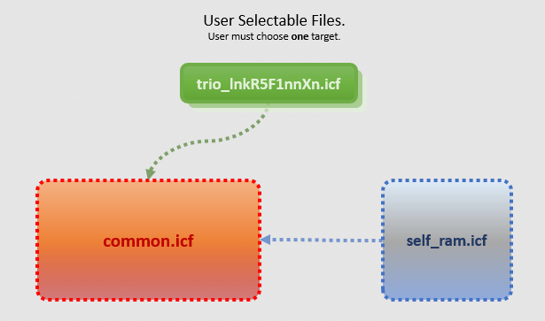
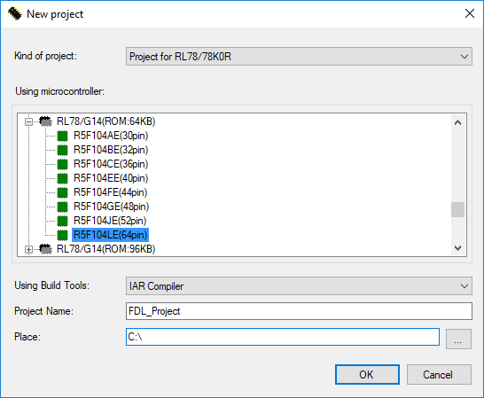
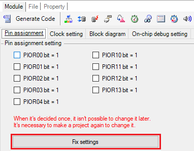
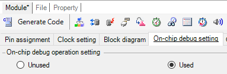
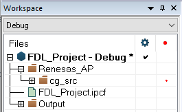

# ICF Trio

## What is the purpose of the ICF Trio Project?
The __ICF Trio__ project was developed for __IAR Embedded Workbench for Renesas RL78__ version __3.10 or later__. It uses a set of 3 files which together will lead to a proper linker configuration for the memory reservation requirements when there are __RL78 Flash Libraries__ in use.

### Benefits 
* Provides simplified setup for new projects relying on any of the __RL78 Flash Libraries__.
* Reduces the developer's efforts when linker reconfiguration is needed, specially when retargeting or switching to a different __RL78 Flash Library__.
* Offers contiguous __Code Flash__ which leads to improved flexibility for the compiled objects placement during the linking stage. This is achieved by taking advantage of the linker capability of placing all the `__near` constants from the __ending__ of the __Code Flash__'s mirrorable area.
* The improved object placement strategy might lead to substantial reduction of fragmentation of the __Code Flash__. This effect becomes more evident on RL78 targets with smaller __Code Flash__.

### Linker Configuration Trio Layout Specification
In this section you can understand how the __ICF Trio__ components fit together.

| __File__                     | __Description__ |
| :--------------------------- | --------------- |
| __[trio_lnkR5F1nnXn.icf](trio_lnkR5F1---TEMPLATE.icf)__ | The first one is __user-selectable__. The selection is made based on the similarity in the memory map for distinct groups of RL78 targets. Each of these files hold the proper __Linker Configuration Override__ parameters which can be set on the __Project options__.  The `X` within the part number means that the linker configuration is offered regardless the target's pin count. For example, __trio_lnkR5F100xE.icf__ should be selected for a __R5F100LE__ target. |
| [common.icf](common.icf)     | The second is automatically included from the user-selected configuration. This is the heart of the Trio, containing parametrized directives which can be applied to any of the supported RL78 targets. |
| [self_ram.icf](self_ram.icf) | The third is automatically included by __common.icf__ to evaluate the [RAM reservation symbol](README.md#ram-reservation-symbols) used by the linker to reserve the appropriate amount of RAM (for _Self-RAM_) when using the Trio. |

### Flash Library Flavors
The Renesas RL78 MCUs require specific set of libraries to enable usage of their Flash Memories.

Renesas Electronics provides the __RL78 Flash Libraries__ in 3 different flavors:
- The __FSL__ (Flash Self-Programming Library) does program the RL78's __Code Flash__. 
- The __FDL__ (Flash Data Library) does program the RL78's __Data Flash__.
- The __EEL__ (EEPROM Emulation Library) does emulate EEPROM behaviour on the RL78's __Data Flash__. It provides an extra layer of functionalities on top of its corresponding companion FDL Library Type (T01 or T02 - [explained below](README.md#flash-library-types)). It provides transparent [__Wear Leveling__](https://en.wikipedia.org/wiki/Wear_leveling) among the provisioned __Data Flash__ blocks which may, in practice, virtually raise the amount of possible rewrites.

## Flash Library Types 
The __RL78 Flash Libraries__ flavors may be provided as one of the following library types:
- The **T01** (Type01, also known as **Full**) are the fully fledged Flash Libraries.
- The **T02** (Type02, also known as **Tiny**) are the balanced ones, providing the main functionalities at expense of less resources when compared with the T01 Libraries.
- The **T04** (Type04, also known as **Pico**) is the one providing only the bare essential functionalities. This library type offers the lowest resource usage footprint. Usually this is the suitable choice for the scenarios where the chosen RL78 target comes with constrained memory resources.

> __Note__ For further information regarding the complete feature set provided in each of these flash libraries, refer to their respective [documentation](#ram-reservation-symbols).

### Self-RAM 
Typically for every combination of RL78 MCU and __RL78 Flash Library__, the programmer would need to refer to the _Renesas Electronics_'  __[Application Note document r20ut2944][url-ree-selfram]__ in order to know if the chosen combination will require some specific RAM range to be reserved, therefore the chosen combination can function properly.

Self-RAM refers to the aforementioned RAM area, which __must__ be reserved on some cases, when relying on the RL78 MCU's self-programming capabilities.

In order to tremendously simplify this process, the __ICF Trio__ mostly automates it, by taking advantage of every advanced linker configuration directive available to override the default linker configuration, while following the requirements defined in the aforementioned Application Note. 

## How to use the ICF Trio
The following sections are a step-by-step guide on how to create and configure a project that takes advantage of the __ICF Trio__ from scratch.

As reference, the [Renesas Promotion Board for RL78/G14](https://renesas.com/yrpbrl78g14) was used as target for the walkthrough. The [examples](#examples) used the most popular flash library combinations. 

Regardless, similar steps can be used with other combinations of RL78 targets and related flash libraries.

### Pre-requisites
In this walkthrough, the following components already installed or downloaded:
- Default installation of [IAR Embedded Workbench for Renesas RL78 v4.21][url-ewrl78].
- A __RL78 Flash Library__ of your choice, downloadable from the _Renesas Electronics Europe "MyPages"_. The download requires [pre-registration][url-ree-register] or [sign-in][url-ree-signin] if you already are a registered user.

### RAM reservation symbols
The table below lists the available libraries alongside their respective __documentation__ as well as the project's required linker __symbol__ used for RAM reservation.

| __RL78 Flash Library__ | __Documentation__          | __Symbol__            | __Reserves Self-RAM for the...__         |
| :--------------------: | :------------------------: | :-------------------: | :--------------------------------------- |
| [T01-FSL][url-t01-fsl] | [T01-FSL][url-t01-fsl-doc] | `__RESERVE_T01_FSL=1` | ...__T01-FSL__ Code Flash Library        |
| [T01-FDL][url-t0x-xxl] | [T01-FDL][url-t01-fdl-doc] | `__RESERVE_T01_FDL=1` | ...__T01-FDL__ Data Flash Library        |
| [T01-EEL][url-t0x-xxl] | [T01-EEL][url-t01-eel-doc] | `__RESERVE_T01_EEL=1` | ...__T01-EEL__ EEPROM Emulation Library  |
| [T02-FDL][url-t0x-xxl] | [T02-FDL][url-t02-fdl-doc] | `__RESERVE_T02_FDL=1` | ...__T02-FDL__ Tiny Data Flash Library   |
| [T02-EEL][url-t0x-xxl] | [T02-EEL][url-t02-eel-doc] | `__RESERVE_T02_EEL=1` | ...__T02-EEL__ EEPROM Emulation Library  |
| [T04-FDL][url-t0x-xxl] | [T04-FDL][url-t04-fdl-doc] | `__RESERVE_T04_FDL=1` | ...__T04-FDL__ Pico Flash Lbrary         |

### Creating a base project with Applilet3
Applilet3 and AP4 are GUI-based code generators that can generate startup and peripheral drivers in C for RL78 targets.

- The _IAR Embedded Workbench for Renesas RL78_ installs the _Renesas Electronics' Applilet3_ code generator. Launch the __Applilet3__ tool.

- Create a new project named _Project Name_ which targets the board's MCU (PN# __[R5F104LEAFA][url-r5f104leafa]__), using the __IAR Compiler__ as _Build Tool_.

- On __Pin assignment__ tab, click on __Fix settings__.

- On the __On-Chip debug setting__ tab, enable the __On-chip debug operation setting__.

- Enable the __Low Voltage Detection__, selecting any coherent value for _VLVD_, such as *3.63V*. Save the Project. Finally, click on __Generate code__.

### Setup the project in the IAR Embedded Workbench
- Start the __IAR Embedded Workbench for RL78__, save the the Workspace (`.eww`) on the same project folder which was created at the chosen _Place_. This folder can (and will) be referred by __IAR Embedded Workbench__ through its built-in environment variable `$PROJ_DIR$`.
> __Note__ The `$PROJ_DIR$` is a project's internal argument variable which translates to the directory containing the `.ewp` file. It is oftentimes used to refer to project's resources using relative pathnames that will not change if the project is moved to a different location. The __IAR Embedded Workbench__ brings an extensive range of [built-in argument variables][url-argvars].

- Choose __Project__ → __Create New Project...__ and create an _Empty RL78 project_. Save it on the project's `$PROJ_DIR$` location.

- Choose __Project__ → __Add Project Connection...__ and point to the `.ipcf` file which has been created by the __Applilet3__ when the code was generated.

- [__Clone__](https://docs.github.com/en/repositories/creating-and-managing-repositories/cloning-a-repository) this repository inside `$PROJ_DIR$`.
> __Note__ Alternatively this repository can be downloaded as a `.zip` archive via the __Code__ button.

## Examples
From this point you can now choose one of the examples below, which contains further steps for creating simple programs which exercise the Flash Memories while using different combinations of the most popular __RL78 Flash Libraries__.

## Coding Examples

| __Example__                       | __Description__ |
| :-------------------------------- | :-------------- |
| [T04-FDL](t04-fdl.md) | Creates a simple program which uses the T04-FDL Library in order to store some data in the RL78 __Data Flash__ | 
| [T01-FSL](t01-fsl.md) | Creates a simple program which uses the T01-FSL Library in order to store some data in the RL78 __Code Flash__ |
| [T02-EEL](t02-eel.md) | Creates a program which uses the T02-EEL Library and its corresponding dependency, the T02-FDL library. It exercises storing and retrieving data from the __EEL pool__ as well as from the __FDL pool__, both located into the RL78 __Data Flash__ |

## Issues
Found an issue or have a suggestion related to [__this__][url-repo] repository? Feel free to use the public issue tracker.
- Do not forget to take a look at [earlier issues][url-repo-issue-old].
- If creating a [new][url-repo-issue-new] issue, please describe it in detail.

<!-- links -->
[url-repo]:           https://github.com/iarsystems/ewrl78-linker-config-flashlibs
[url-repo-issue-new]: https://github.com/iarsystems/ewrl78-linker-config-flashlibs/issues/new
[url-repo-issue-old]: https://github.com/iarsystems/ewrl78-linker-config-flashlibs/issues?q=is%3Aissue+is%3Aopen%7Cclosed

[url-ree-register]:   https://www2.renesas.eu/products/micro/download/index.html/auth/register
[url-ree-signin]:     https://www2.renesas.eu/products/micro/download/index.html/auth/login
[url-ree-selfram]:    https://renesas.com/document/mah/rl78-family-self-ram-list-flash-self-programming-library

[url-r5f104leafa]: https://www.renesas.com/rl78g14

[url-ewrl78]: https://www.iar.com/ewrl78
[url-applilet3]: https://www.renesas.com/us/en/document/applilet3-rl78-v12000?language=en
[url-git4win]: https://git-scm.com/download/win
[url-argvars]: https://netstorage.iar.com/SuppDB/Public/UPDINFO/014217/ew/doc/EWRL78_IDEGuide.ENU.pdf#page=82

[url-t01-fsl]:     https://www2.renesas.eu/products/micro/download/?oc=SelfLib_RL78
[url-t0x-xxl]:     https://www2.renesas.eu/products/micro/download/?oc=EEPROM_EMULATION_RL78
[url-t01-fsl-doc]: https://www2.renesas.eu/products/micro/download/?oc=SelfLib_RL78#documentInfo
[url-t01-fdl-doc]: https://www2.renesas.eu/products/micro/download/?oc=EEPROM_EMULATION_RL78#documentInfo
[url-t01-eel-doc]: https://www2.renesas.eu/products/micro/download/?oc=EEPROM_EMULATION_RL78#documentInfo
[url-t02-fdl-doc]: https://www2.renesas.eu/products/micro/download/?oc=EEPROM_EMULATION_RL78#documentInfo
[url-t02-eel-doc]: https://www2.renesas.eu/products/micro/download/?oc=EEPROM_EMULATION_RL78#documentInfo
[url-t04-fdl-doc]: https://www2.renesas.eu/products/micro/download/?oc=EEPROM_EMULATION_RL78#documentInfo
