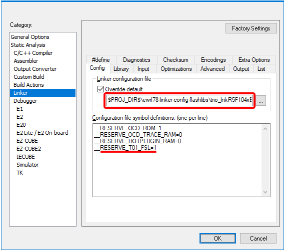
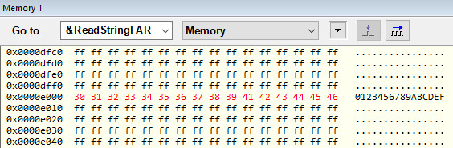
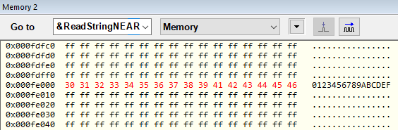

## Project Setup Example for T01-FSL  

You can refer to the previous setup steps [here](README.md#usage-guidelines).

**12.** Back to the __IAR Embedded Workbench for RL78__, go to the Project Options, `Linker` → `Config` → `Override default` and select the corresponding `trio_lnk<device>.icf` for the target device in use. In this example, the __R5F104LEA__ target will be used, so the [trio_lnkR5F104xE.icf](trio_lnkR5F104xE.icf) will be selected:
```
$PROJ_DIR$\ewrl78-linker-config-flashlibs\trio_lnkR5F104xE.icf
```

>:bulb: Each target device has its own memory reservation requirements. In order to get the best out of the trio configurations, please choose the appropriate `trio_lnk<device>.icf` linker configuration for the actual `<device>` you are using in your project, directly from the repository you cloned inside the project's directory (`$PROJ_DIR$\ewrl78-linker-config-flashlibs`).

**13.** On the same `Linker` → `Config` configuration page of the project options, add the following line containing the symbol definition in `Configuration file symbol definition`:

```
__RESERVE_T01_FSL=1
```



**14.** Install the [RL78 T01-FSL Library](https://www2.renesas.eu/products/micro/download/?oc=SelfLib_RL78) downloadable from its distribution site. Install it for the __IAR Compiler v2.10__ (or later) on the project folder (__$PROJ_DIR$__). The installer will create a folders within the __$PROJ_DIR$__ named __FSL\IAR_210__ (or similar). Adjust it accordingly if necessary, as this installer may create a slighty different folder name depending on the version available.  

> __Note__ 
> * Before downloading the library using the link above, [__Sign in__](https://www2.renesas.eu/products/micro/download/index.html/auth/login) to the European Downloads "MyPages" site ([here](https://www2.renesas.eu/products/micro/download/index.html)) if necessary. The credentials for __"MyPages"__ may differ from the __"MyRenesas"__ credentials.

**15.** In `Linker` → `Library` → `Additional libraries`, add the following line:
```
$PROJ_DIR$\FSL\IAR_210\lib\fsl.a
```
**16.** In `C/C++ Compiler` → `Preprocessor` → `Additional include directories`, add the following 2 lines:
```
$PROJ_DIR$\applilet3_src
$PROJ_DIR$\FSL\IAR_210\lib
```

## Putting the Library to some use

**17.** Open the __Renesas_AP\cg_src\r_main.c__ and insert the FSL headers between the two __Applilet3__'s comment guards, as below:
```c
...
/* Start user code for include. Do not edit comment generated here */
/* FSL headers */
#include "fsl.h"
#include "fsl_types.h"
/* End user code. Do not edit comment generated here */
#include "r_cg_userdefine.h"
...
```

**18.** Add the global arrays __WriteStringFAR__, __WriteStringNEAR__ and __ReadString__ between the two __Applilet3__'s comment guards. These global variables are going to be preserved if the drivers are eventually regenerated for any reason, by the __Applilet3__ tool.
```c
/********************************...**
Global variables and functions
*********************************...**/
/* Start user code for global. Do not edit comment generated here */

#define FSL_BLOCK_SIZE   (0x0400U)

/* Set the FSL BLOCK (1KB) address within the mirror-able region */
#define FSL_BLOCK_ADDR   (0x010000U - 8U*FSL_BLOCK_SIZE)
#define FSL_BLOCK_SLOT   (FSL_BLOCK_ADDR/FSL_BLOCK_SIZE)

/* The FSL BLOCK will be mirrored on the Near Area */ 
#define FSL_BLOCK_ADDR_MIRRORED  (FSL_BLOCK_ADDR | 0xF0000U)

#define STRING_SZ 16
fsl_u08 WriteString[STRING_SZ] = "0123456789ABCDEF";

/* Access the data directly from the Code Flash (24-bit __far address) */
#pragma location = FSL_BLOCK_ADDR
__root __far const fsl_u08 ReadStringFAR[STRING_SZ];

/* Access the data from the Mirror Area (16-bit __near address - more efficient access!) */
#pragma location = FSL_BLOCK_ADDR_MIRRORED
__root __near __no_init fsl_u08 ReadStringNEAR[STRING_SZ];

/* End user code. Do not edit comment generated here */
```

**19.** On the __Renesas_AP\cg_src\r_main.c__, replace the __main()__ function with the following code snippet:
```c
void main(void)
{
    R_MAIN_UserInit();
    /* Start user code. Do not edit comment generated here */
    
    /* FSL local vars */
    fsl_descriptor_t FSL_descriptor;
    fsl_write_t      FSL_wr;
    fsl_u08          FSL_status;

    /* Initiate the FSL library */
    FSL_descriptor.fsl_flash_voltage_u08 = 0x00;
    FSL_descriptor.fsl_frequency_u08 = 32;
    FSL_descriptor.fsl_auto_status_check_u08 = 0x01;
    FSL_status = FSL_Init((__far fsl_descriptor_t*)&FSL_descriptor);
    if (FSL_OK != FSL_status)
    {
        while(1);
    }
    FSL_Open();
    FSL_PrepareFunctions();

    /* Erases the FSL_BLOCK_SLOT contents */
    FSL_status = FSL_Erase(FSL_BLOCK_SLOT);
    while (FSL_BUSY == FSL_status)
    {
        FSL_status = FSL_StatusCheck();
    }

    /* Writes "WriteString" to the FSL_BLOCK_ADDR */
    FSL_wr.fsl_data_buffer_p_u08 =  WriteString;
    FSL_wr.fsl_word_count_u08 = STRING_SZ/4; // 32-bit aligned writes
    FSL_wr.fsl_destination_address_u32 = FSL_BLOCK_ADDR;
    FSL_status = FSL_Write(&FSL_wr);
    while (FSL_BUSY == FSL_status)
    {
        FSL_status = FSL_StatusCheck();
    }

    /* Closes the FSL */
    FSL_Close();

    /* The infinite loop */
    for (;;)
    {
    }
    /* End user code. Do not edit comment generated here */
}

```

## Now to the project's hardware setup and debugging

**20.** Go to project options, `General Options` → `Target` → `Device` and choose the desired part number. In this case the __R5F104LE__ will be selected.

**21.** In the project options, `Debugger` → `Setup` → `Driver` and choose the emulator you have. Typically __TK__, __E1__ or __E2 Lite__ depending on the debug probe in use.

**22.** Start a new C-SPY debugging session by choosing `Project` → `Download and Debug`. If necessary, choose the right __Power supply__ voltage for the Target system in the __Emulator Hardware Setup__ window. In this case, as the __LVD__ was set to 3.63V, the choosen voltage was 5V.

**23.** Check the `[x] Erase flash before next ID check` and then press `OK` to close the __Hardware Setup__ window.

**24.** By default, C-SPY will execute the application until it reaches a breakpoint in the beginning of the __main()__ function. Insert a breakpoint near the __FSL_Close()__ call in the end of the __main()__ function.

**25.** Activate the __Watch Window__ by selecting `View` → `Watch` → `Watch1`. This window will allow you to add expressions to watch the contents of global variables. `<Click to add>` __ReadStringNEAR__, __ReadStringFAR__ and __WriteString__.

**26.**  Hit `Go` on the __Debug Toolbar__ (or press <kbd>F5</kbd>) and verify if the variables contents match.

> __Notes__ 
> * The data written into the __Code Flash__ can also be directly seen by activating the __Memory Window__. In this case, select `View` → `Memory` → `Memory1` and `Go to` the address __&ReadStringFAR__.
>
>  
>
> * The same data will be also available from the Near Memory __(0xF0000-0xFFFFF)__, which provides a computationally cheaper way of accessing the same data. This area is addressable by 16-bit pointers. Activate a new __Memory Window__ by selecting `View` → `Memory` → `Memory2` and `Go to` the address __&ReadStringNEAR__ to visit the __Mirrored Data__.
>
>  

---
[Back to the main ICF Trio Documentation Page](README.md#coding-examples)
