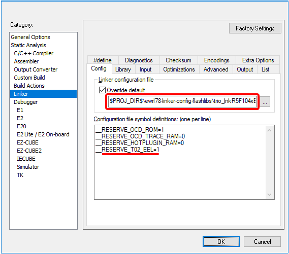

### Project Setup Example for T02-EEL (tiny EEL) 

You can refer to the previous setup steps [here](README.md#usage-guidelines).

**13.** On the same `Linker` → `Config` configuration page of the project options, add the following line containing the symbol definition in `Configuration file symbol definition`:

```
__RESERVE_T02_EEL=1
```



**14.** Install the [RL78 T02-EEL Library](https://www2.renesas.eu/products/micro/download/?oc=EEPROM_EMULATION_RL78) you've previously downloaded from its distribution site. Install it for the __IAR Compiler v2.10__ (or later) on the project folder (__$PROJ_DIR$__). The installer will create folders within the __$PROJ_DIR$__ named __EEL\IAR_210__ (or similar). Adjust it accordingly if necessary, as this installer may create a slighty different folder names depending on the version available.  

> __Note__ 
> * Before downloading the library using the link above, [__Sign in__](https://www2.renesas.eu/products/micro/download/index.html/auth/login) to the European Downloads "MyPages" site ([here](https://www2.renesas.eu/products/micro/download/index.html)) if necessary. The credentials for __"MyPages"__ may differ from the __"MyRenesas"__ credentials.

---

**15.** In `Linker` → `Library` → `Additional libraries`, add the following lines:
```
$PROJ_DIR$\EEL\IAR_210\FDL\lib\fdl.a
$PROJ_DIR$\EEL\IAR_210\EEL\lib\eel.a
```
**16.** In `C/C++ Compiler` → `Preprocessor` → `Additional include directories`, add the following lines:
```
$PROJ_DIR$\applilet3_src
$PROJ_DIR$\EEL\IAR_210\FDL\lib
$PROJ_DIR$\EEL\IAR_210\EEL\lib
```

---

### Putting the Library to some use

**17.** Open the __Renesas_AP\cg_src\r_main.c__ and insert the __tiny FDL__ and __tiny EEL__ headers between the two __Applilet3__'s comment guards, as below:
```c
...
/* Start user code for include. Do not edit comment generated here */
#include "fdl.h"
#include "fdl_types.h"
#include "eel.h"
#include "eel_types.h"
/* End user code. Do not edit comment generated here */
#include "r_cg_userdefine.h"
...
```

**18.** Add the following code snippet between the two __Applilet3__'s comment guards. These contents are going to be preserved if the drivers are eventually regenerated for any reason, by the __Applilet3__ tool.
```c
/********************************...**
Global variables and functions
*********************************...**/
/* Start user code for global. Do not edit comment generated here */

/* FDL and EEL macros */
#define FDL_BLOCK_SIZE  (0x400U)
#define FDL_FREQ_MHZ    (32)
#define FDL_DELAY       ((fdl_u16)(10*FDL_FREQ_MHZ/6))

#define FDL_POOL_BLOCKS (1)
#define FDL_POOL_BYTES  (FDL_POOL_BLOCKS*FDL_BLOCK_SIZE)

#define EEL_POOL_BLOCKS (3)
#define EEL_POOL_BYTES  (EEL_POOL_BLOCKS*FDL_BLOCK_SIZE)

/* Global data variables */
#define STRING_SZ (16)

typedef fdl_u08 fdl_configdata_t[STRING_SZ];

typedef eel_u08 eel_record01_t;
typedef eel_u08 eel_record04_t[STRING_SZ/4];
typedef eel_u08 eel_record16_t[STRING_SZ];
typedef eel_u08 eel_record64_t[4*STRING_SZ];
enum {EEL_RECZZ_NULL,
      EEL_REC01_ID,
      EEL_REC04_ID,
      EEL_REC16_ID,
      EEL_REC64_ID,
      EEL_REC_TERMINATOR,
      EEL_DESCRIPTOR_SZ,};

#pragma location="EEL_CNST"
#pragma data_alignment=2
__far const eel_u08 eel_descriptor[EEL_DESCRIPTOR_SZ] =
{
  (eel_u08)(EEL_REC_TERMINATOR-1),    /* variable count   */  \
  (eel_u08)(sizeof(eel_record01_t)),  /* id=1             */  \
  (eel_u08)(sizeof(eel_record04_t)),  /* id=2             */  \
  (eel_u08)(sizeof(eel_record16_t)),  /* id=3             */  \
  (eel_u08)(sizeof(eel_record64_t)),  /* id=4             */  \
  (eel_u08)(0x00),                    /* zero terminator  */  \
};

#pragma location="EEL_CNST"
#pragma data_alignment=2
__far const eel_u08  eel_internal_cfg_cau08[] = { 0x40 };

/* Populate the EEL "wr_recordXX" records */ 
eel_record01_t wr_record01 = 'S';
eel_record04_t wr_record04 = "XYWZ";
eel_record16_t wr_record16 = "0123456789ABCDEF";
eel_record64_t wr_record64 = "0123456789ABCDEF0123456789ABCDEF0123456789ABCDEF0123456789ABCDEF";
eel_record64_t w2_record64 = "A5A5A5A5A5A5A5A5A5A5A5A5A5A5A5A5A5A5A5A5A5A5A5A5A5A5A5A5A5A5A5A5";

/* Declare the EEL "rd_recordXX" records for read-back  */
eel_record01_t rd_record01;
eel_record04_t rd_record04;
eel_record16_t rd_record16;
eel_record64_t rd_record64;

/* Populates the FDL data variable */
fdl_configdata_t wr_configdata = "#012.456.89A.CDE";

/* Declares the FDL data variable to read-back*/
fdl_configdata_t rd_configdata;

/* End user code. Do not edit comment generated here */
```

**19.** On the __Renesas_AP\cg_src\r_main.c__, replace the entire __main()__ function with the following code snippet. The execution flow exercises some basic flash operations using both __EEL__ and __FDL__ layers.
```c
void main(void)
{
    R_MAIN_UserInit();
    /* Start user code. Do not edit comment generated here */
    
    /* FDL and EEL local vars */
    fdl_request_t    FDL_request;
    fdl_descriptor_t FDL_descriptor;
    eel_request_t    EEL_request;
    uint8_t          xxL_status;

    /* Initialize T02-FDL */
    FDL_descriptor.eel_pool_bytes_u16    = EEL_POOL_BYTES;
    FDL_descriptor.fdl_pool_bytes_u16    = FDL_POOL_BYTES;
    FDL_descriptor.fdl_delay_u16         = FDL_DELAY;
    FDL_descriptor.eel_pool_blocks_u08   = EEL_POOL_BLOCKS;
    FDL_descriptor.fdl_pool_blocks_u08   = FDL_POOL_BLOCKS;
    FDL_descriptor.fx_MHz_u08            = FDL_FREQ_MHZ;
    FDL_descriptor.wide_voltage_mode_u08 = 0x00U;
    xxL_status = FDL_Init(&FDL_descriptor);
    if (FDL_OK != xxL_status)
    {
      while(1);
    }
    FDL_Open();

    /* Initialize T02-EEL */
    xxL_status = EEL_Init();
    if (EEL_OK != xxL_status)
    {
      while(1);
    }
    EEL_Open();

    /* Format the EEL pool before it can be used */
    EEL_request.command_enu = EEL_CMD_FORMAT;
    EEL_Execute(&EEL_request);
    do { EEL_Handler(); } while (EEL_BUSY == EEL_request.status_enu);

    /* Start the EEL pool */
    EEL_request.command_enu = EEL_CMD_STARTUP;
    EEL_Execute(&EEL_request);
    do { EEL_Handler(); } while (EEL_BUSY == EEL_request.status_enu);

    /* Write on different EEL variables */
    EEL_request.command_enu = EEL_CMD_WRITE;
    EEL_request.address_pu08 = &wr_record01;
    EEL_request.identifier_u08 = EEL_REC01_ID;
    EEL_Execute(&EEL_request);
    do { EEL_Handler(); } while (EEL_BUSY == EEL_request.status_enu);
    EEL_request.address_pu08 = wr_record04;
    EEL_request.identifier_u08 = EEL_REC04_ID;
    EEL_Execute(&EEL_request);
    do { EEL_Handler(); } while (EEL_BUSY == EEL_request.status_enu);
    EEL_request.address_pu08 = wr_record16;
    EEL_request.identifier_u08 = EEL_REC16_ID;
    EEL_Execute(&EEL_request);
    do { EEL_Handler(); } while (EEL_BUSY == EEL_request.status_enu);
    EEL_request.address_pu08 = wr_record64;
    EEL_request.identifier_u08 = EEL_REC64_ID;
    EEL_Execute(&EEL_request);
    do { EEL_Handler(); } while (EEL_BUSY == EEL_request.status_enu);
    
    /*
     *  T02-EEL allows record updates to be performed 
     *  without requiring full block erasure upfront 
     */
    EEL_request.address_pu08 = w2_record64;
    EEL_request.identifier_u08 = EEL_REC64_ID;
    EEL_Execute(&EEL_request);
    do { EEL_Handler(); } while (EEL_BUSY == EEL_request.status_enu);
    
    /* Read the previously EEL variables */
    EEL_request.command_enu = EEL_CMD_READ;
    EEL_request.address_pu08 = &rd_record01;
    EEL_request.identifier_u08 = EEL_REC01_ID;
    EEL_Execute(&EEL_request);
    do { EEL_Handler(); } while (EEL_BUSY == EEL_request.status_enu);
    EEL_request.address_pu08 = rd_record04;
    EEL_request.identifier_u08 = EEL_REC04_ID;
    EEL_Execute(&EEL_request);
    do { EEL_Handler(); } while (EEL_BUSY == EEL_request.status_enu);
    EEL_request.address_pu08 = rd_record16;
    EEL_request.identifier_u08 = EEL_REC16_ID;
    EEL_Execute(&EEL_request);
    do { EEL_Handler(); } while (EEL_BUSY == EEL_request.status_enu);
    EEL_request.address_pu08 = rd_record64;
    EEL_request.identifier_u08 = EEL_REC64_ID;
    EEL_Execute(&EEL_request);
    do { EEL_Handler(); } while (EEL_BUSY == EEL_request.status_enu);
                               
    /* Erase FDL config data block */
    FDL_request.command_enu = FDL_CMD_ERASE_BLOCK;
    FDL_request.index_u16 = 0x0000U;   // Virtual address for the FDL Pool
    FDL_Execute(&FDL_request);
    do { FDL_Handler(); } while (FDL_BUSY == FDL_request.status_enu);
    
    /* Write FDL config data */
    FDL_request.command_enu = FDL_CMD_WRITE_BYTES;
    FDL_request.bytecount_u16 = sizeof(fdl_configdata_t);
    FDL_request.data_pu08 = wr_configdata;
    FDL_Execute(&FDL_request);
    do { FDL_Handler(); } while (FDL_BUSY == FDL_request.status_enu);
  
    /* Read FDL config data */
    FDL_request.command_enu = FDL_CMD_READ_BYTES;
    FDL_request.data_pu08 = rd_configdata;
    FDL_Execute(&FDL_request);
    do { FDL_Handler(); } while (FDL_BUSY == FDL_request.status_enu);

    /* EEL and FDL shutdown */
    EEL_request.command_enu = EEL_CMD_SHUTDOWN;
    EEL_Execute(&EEL_request);
    EEL_Close();
    FDL_Close();
    
    while (1U)
    {
        ;
    }
    /* End user code. Do not edit comment generated here */
}
```
**20.** By default, the ICF Trio configuration reserves the memory to work with the maximum amount of variables allowed by the library. For this case, open the [trio_lnkrR5F104xE.icf](https://github.com/sharpgeek/icf_trio_config/blob/master/trio_lnkR5F104xE.icf) or corresponding file and then reduce the amount of **_T02_EEL_NUM_VARS** to __4__, in order to significantly save on resource usage. The Self-RAM usage for EEL variables goes from 384 bytes to 264 bytes (a 31.25% reduction), as follows:
```c
// Maximum number of variables for EEPROM Emulation Layer Libraries
define symbol _T01_EEL_NUM_VARS = 256; // [1~256 variables]
define symbol _T02_EEL_NUM_VARS = 4;   // [1~64  variables] 
```

---

### Now to the project's hardware setup and debugging

**21.** Go to project options, `General Options` → `Target` → `Device` and choose the desired part number. In this case the __R5F104LE__ will be selected.

**22.** In the project options, `Debugger` → `Setup` → `Driver` and choose the emulator you have. Typically __TK__, __E1__ or __E2 Lite__ depending on the emulator in use.

**23.** Start a new C-SPY debugging session by choosing `Project` → `Download and Debug`. If necessary, choose the right __Power supply__ voltage for the target system in the __Emulator Hardware Setup__ window. In order to function properly, as the __LVD__ was set to 3.63V, the choosen voltage was 5V.

**24.** Check the `[x] Erase flash before next ID check` and then press `OK` to close the __Hardware Setup__ window.

**25.** By default, C-SPY will execute the application until it reaches a breakpoint in the beginning of the __main()__ function. Insert a breakpoint near the __FSL_Close()__ call in the end of the __main()__ function. 

**26.** Activate the `Watch Window` by selecting `View` → `Watch` → `Watch1`. This window will allow you to add expressions to watch the contents of the global variables used to hold different record types used to test the __EEL Pool__. `<Click to add>` __rd_recordXX__ (where __XX__ can be 01, 04, 16 or 64) and also __wr_recordXX__(where __XX__ can be 01, 04, 16 or 64).

**27.**  Hit `Go` on the Debug toolbar (or press <kbd>F5</kbd>) and verify if the variables contents match.

> __Note__
> * When performing the contents matching step, remember that the __EEL_REC64_ID__ variable had its contents updated after its contents updated of __wr_record64__ to the contents of the __w2_record64__ before it has been read with the __EEL_CMD_READ__ to be read back into the __rd_record64__ variable.

**26.** The same verification should be performed between __wr_configdata__ and __rd_configdata__ available from the __FDL Pool__.

> __Note__ 
> * The config data written into the __FDL Pool__ can also be directly seen at the __Data Flash__. Activate the __Memory Window__ by selecting `View` → `Memory` → `Memory1` and `Go to` the address __0xF1C00__, which is the offset __0x0000__ of the __FDL Pool__.
>
> 

---

[Back to the main ICF Trio Documentation Page](README.md#coding-examples)
