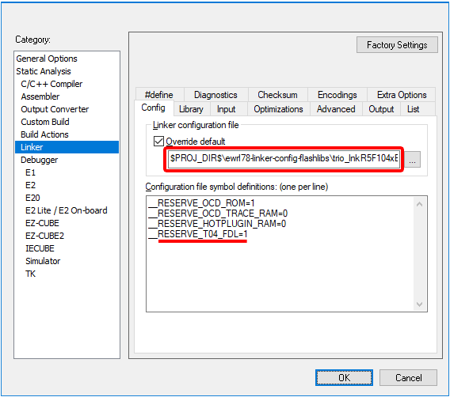
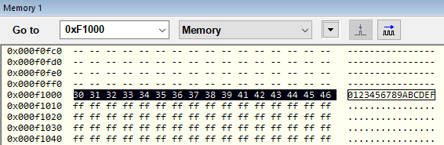

### Project Setup Example for T04-FDL (pico FDL) 

You can refer to the previous setup steps [here](README.md#usage-guidelines).

**13.** On the same `Linker` → `Config` configuration page of the project options, add the following line containing the symbol definition in `Configuration file symbol definition`:

```
__RESERVE_T04_FDL=1
```


**14.** Install the [RL78 T04-FDL Library](https://www2.renesas.eu/products/micro/download/?oc=EEPROM_EMULATION_RL78) you've previously downloaded from its distribution site. Install it for the __IAR Compiler v2.10__ (or later) on the project folder (__$PROJ_DIR$__). The installer will create a folders within the __$PROJ_DIR$__ named __FDL\IAR_210__ (or similar). Adjust it accordingly if necessary, as this installer may create a slighty different folder name depending on the version available.  

| __Remark__ |
| ---------- |
| *Before downloading the library using the link above, [__Sign in__](https://www2.renesas.eu/products/micro/download/index.html/auth/login) to the European Downloads "MyPages" site ([here](https://www2.renesas.eu/products/micro/download/index.html)) if necessary. The credentials for __"MyPages"__ may differ from the __"MyRenesas"__ credentials.* |

---

**15.** In `Linker` → `Library` → `Additional libraries`, add the following line:
```
$PROJ_DIR$\FDL\IAR_210\lib\pfdl.a
```
**16.** In `C/C++ Compiler` → `Preprocessor` → `Additional include directories`, add the following 2 lines:
```
$PROJ_DIR$\applilet3_src
$PROJ_DIR$\FDL\IAR_210\lib
```

### Putting the Library to some use

**17.** Open the __Renesas_AP\cg_src\r_main.c__ and insert the __pico FDL__ headers between the two __Applilet3__'s comment guards, as below:
```c
...
/* Start user code for include. Do not edit comment generated here */
/* Pico FDL headers */
#include "pfdl.h"
#include "pfdl_types.h"
/* End user code. Do not edit comment generated here */
#include "r_cg_userdefine.h"
...
```

**18.** Just like before, add these two global arrays between the two __Applilet3__'s comment guards. These global variables are going to be preserved if the drivers are eventually regenerated for any reason, by the __Applilet3__ tool.
```c
/********************************...**
Global variables and functions
*********************************...**/
/* Start user code for global. Do not edit comment generated here */
#define STRING_SZ 16
pfdl_u08 WriteString[STRING_SZ] = "0123456789ABCDEF";
pfdl_u08 ReadString[STRING_SZ];
/* End user code. Do not edit comment generated here */
```

**19.** On the __Renesas_AP\cg_src\r_main.c__, replace the __main()__ function with the following code snippet:
```c
void main(void)
{
    R_MAIN_UserInit();
    /* Start user code. Do not edit comment generated here */
    /* pico FDL local vars */
    pfdl_descriptor_t PFDL_descriptor;
    pfdl_request_t    PFDL_request;
    pfdl_status_t     PFDL_status;

    /* Open the pico FDL */
    PFDL_descriptor.fx_MHz_u08 = 32;
    PFDL_descriptor.wide_voltage_mode_u08 = 0;
    PFDL_Open (&PFDL_descriptor);
 
    /* Check if the Data Flash region is blank */
    PFDL_request.index_u16 = 0x0000; // Rel. 16-bit addr @ 0xF1000
    PFDL_request.command_enu = PFDL_CMD_BLANKCHECK_BYTES;
    PFDL_request.bytecount_u16 = STRING_SZ;
    PFDL_status = PFDL_Execute(&PFDL_request);
    while (PFDL_BUSY == PFDL_status)
    {
        PFDL_status = PFDL_Handler();
    }
    
    /* If not empty, erase the entire Data Flash block (1KB) */
    if (PFDL_OK != PFDL_status)
    {
        PFDL_request.index_u16 = 0; // Block number @0xF1000
        PFDL_request.command_enu = PFDL_CMD_ERASE_BLOCK;
        PFDL_request.bytecount_u16 = 0x0000U;
        PFDL_status = PFDL_Execute(&PFDL_request);
        while (PFDL_BUSY == PFDL_status)
        {
            PFDL_status = PFDL_Handler();
        }
    }
    
    /* Write "WriteString" to the Data Flash */
    if (PFDL_OK == PFDL_status)
    {
        PFDL_request.index_u16 = 0x0000; // Rel. 16-bit addr @0xF1000
        PFDL_request.command_enu = PFDL_CMD_WRITE_BYTES;
        PFDL_request.data_pu08 = WriteString;
        PFDL_request.bytecount_u16 = STRING_SZ;
        PFDL_status = PFDL_Execute(&PFDL_request);
        while (PFDL_BUSY == PFDL_status)
        {
            PFDL_status = PFDL_Handler();
        }     
    }
    
    /* Performs internal verify operation to check data retention */
    if (PFDL_OK == PFDL_status)
    {
        PFDL_request.index_u16 = 0x0000; // Rel. 16-bit addr @0xF1000
        PFDL_request.command_enu = PFDL_CMD_IVERIFY_BYTES;
        PFDL_request.bytecount_u16 = STRING_SZ;
        PFDL_status = PFDL_Execute(&PFDL_request);
        while (PFDL_BUSY == PFDL_status)
        {
            PFDL_status = PFDL_Handler();
        }     
    }
    
    /* Read the Data Flash, store into "ReadString" */
    if (PFDL_OK == PFDL_status)
    {
        PFDL_request.index_u16 = 0x0000; // Rel. 16-bit addr @0xF1000
        PFDL_request.command_enu = PFDL_CMD_READ_BYTES;
        PFDL_request.data_pu08 = ReadString ;
        PFDL_request.bytecount_u16 = STRING_SZ;
        PFDL_status = PFDL_Execute(&PFDL_request);
        while (PFDL_BUSY == PFDL_status)
        {
            PFDL_status = PFDL_Handler();
        }     
    }
    
    /* Close the pico FDL */
    PFDL_Close();
 
    /* The infinite loop */
    for (;;)
    {
    }
    /* End user code. Do not edit comment generated here */
}

```

### Now to the project's hardware setup and debugging

**20.** Go to the Project Options, `General Options` → `Target` → `Device` and choose the desired part number. In this case the __R5F104LE__ will be selected.

**21.** In the project options, `Debugger` → `Setup` → `Driver` and choose the emulator you have. Typically __TK__, __E1__ or __E2 Lite__ depending on the emulator in use.

**22.** Start a new C-SPY debugging session by choosing `Project` → `Download and Debug`. If necessary, choose the right __Power supply__ voltage for the Target system in the __Emulator Hardware Setup__ window. In this case, as the __LVD__ was set to 3.63V, the choosen voltage was 5V.

**23.** Check the ` [x] Erase flash before next ID check` and then press `OK` to close the __Hardware Setup__ window.

**24.** By default, C-SPY will execute the application until it reaches a breakpoint in the beginning of the __main()__ function. Insert a breakpoint near the __PFDL_Close()__ call in the end of the __main()__ function.

**25.** Activate the __Watch Window__ by selecting `View` → `Watch` → `Watch1`. This window will allow you to add expressions to watch the contents of global variables. `<Click to add>` __ReadString__ and __WriteString__.

**26.**  Hit `Go` on the Debug toolbar (or press `F5`) and verify if the variables contents match.

| __Remark__ |
| ---------- |
| *The data written into the __Data Flash__ can also be directly seen by activating the __Memory Window__. In this case, select `View` → `Memory` → `Memory1` and `Go to` the address __0xF1000__. This will take the __Memory Window__ straight to the __Data Flash__ initial address.* |
|   |

---

[Back to the main ICF Trio Documentation Page](README.md#coding-examples)
